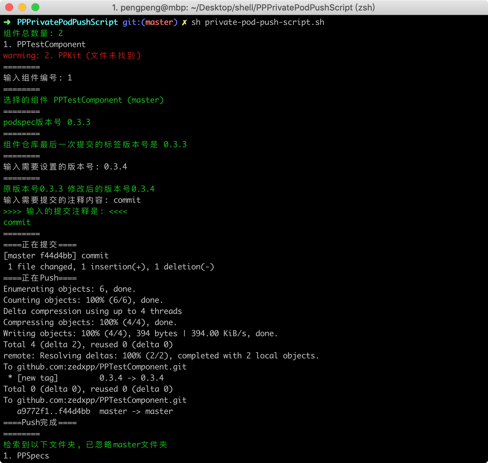
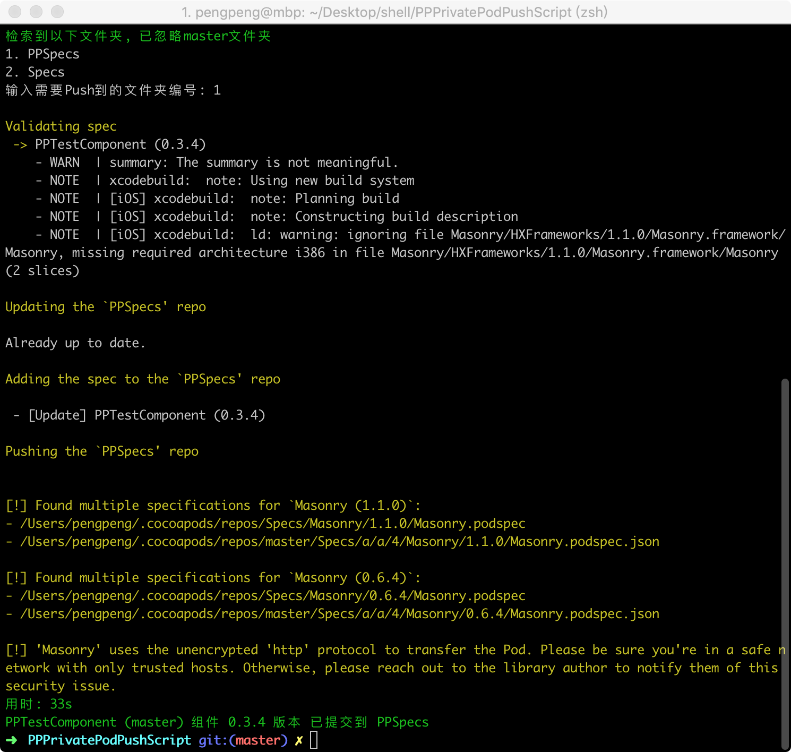
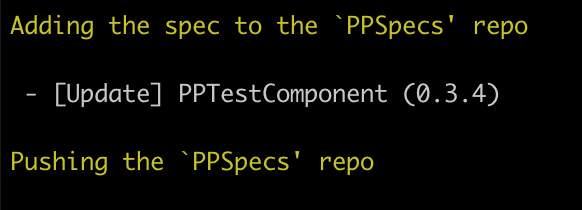

# PPPrivatePodPushScript

## 预览

## 简介

私有库的修改, 提交等操作非常没有技术含量并且繁琐.

1. 修改私有库代码文件
2. 修改私有库`.podspec`文件的版本号
3. 提交所有修改的文件
4. 添加版本的tag并且push所有的提交.
5. cd到私有库`.podspec`文件所在目录, 验证并push私有库.(push的时候会执行pod lib lint)操作, 所以这里省略了.
6. 后续可能还会涉及到修改主工程私有库的版本号, pod install, 运行主工程等操作. 
7. 在以上的基础上, 编写了`private-pod-push-script.sh`脚本. 在终端输入几下命令, 便完成了以上`2~5`的所有操作.

## 使用方式

1. `git clone` 本仓库, `并cd进入本仓库目录`. (建议加入本仓库到Sourcetree, 这样以后我更新了, 你也可以在 Sourcetree检测到)
2. 在`config.sh`里面配置工作路径, 填写所有组件的主仓库地址, 组件项目附加的文件路径以及组件名.(配置好你的组件路径, `config.sh`文件可以放在任何地方)

    - `主仓库地址`是`http://host.com/iOS/Specs.git`(这个是你所有组件存放.podspec文件的仓库地址)
    - `/Users/pengpeng/Desktop/GithubTest/PPTestComponent/PPTestComponent.podspec` 和 `/Users/pengpeng/Desktop/PPKit.podspec` 是我的组件地址
    - `/Users/pengpeng/Desktop/`是工作路径
    - `GithubTest/PPTestComponent/`是附加地址(附加地址选填)
    - `PPTestComponent.podspec`的`PPTestComponent`是组件名
3. 在终端输入`sh private-pod-push-script.sh`执行脚本.

~~3. 在终端输入`chmod +x private-pod-push-script.sh`, 给`private-pod-push-script.sh`文件增加可执行权限. (此步骤只需要执行一次).~~
~~4. 然后输入`./private-pod-push-script.sh`既可执行脚本.~~

 - 自动获取你配置的所有组件, 根据编号排序, `输入你想提交的组件编号`.
 - 自动获取当前`.podspec`版本号和上一次git所提交的tag号, `输入你想设置的版本号, 再输入注释`.
 - `选择你想push到的主仓库名称`, 如果验证成功的情况下, 所有流程已完成.
 
 ### 做好前期的配置后, 以后只需要cd到脚本所在的文件目录下, 执行第4步中的操作即可.
 
 ### 提交成功后, 一定要验证一下打印信息是否出现了这个, 脚本目前无法判断是否真的push私有库成功了.

 
 
## 目前完成的功能

脚本里面我写了`很多注释`, 可以按需修改, 增减自己的需求进去.

- [x] 脚本可以放在任何文件夹, 可以配置多个组件, 多个组件的路径可以不一致, 1个脚本对应多个组件.
- [x] 根据`config.sh`配置文件的内容, 展示你所有配置的组件仓库.
- [x] 对配置的组件`.podspec`文件是否存在进行判断.
- [x] 根据输入的组件编号配置脚本运行环境.
- [x] 获取组件`.podspec`文件版本号, 并且根据你的输入的版本号修改.(自动获取组件最后一次提交的版本号, 方便你判断最新的版本号).
- [x] 输入注释, `自动提交所有修改的文件`并且push.
- [x] 根据选择的本地specs文件夹进行组件推送.
- [x] 脚本重要的输出内容时,输出的文本颜色特殊处理.
- [x] 编号类型的输入内容验证, 输入错误(非数字)一直循环下去.
- [x] 组件推送后重要的信息输出.

> 后续还会根据需求增加别的功能, 为了方便使用者更新脚本, 所以把配置文件和脚本拆分了. 只需要更新脚本, 再把最新的脚本和配置文件放到一起既可. 也可以把配置文件放到别处, 配置文件的路径在脚本中可以设置.